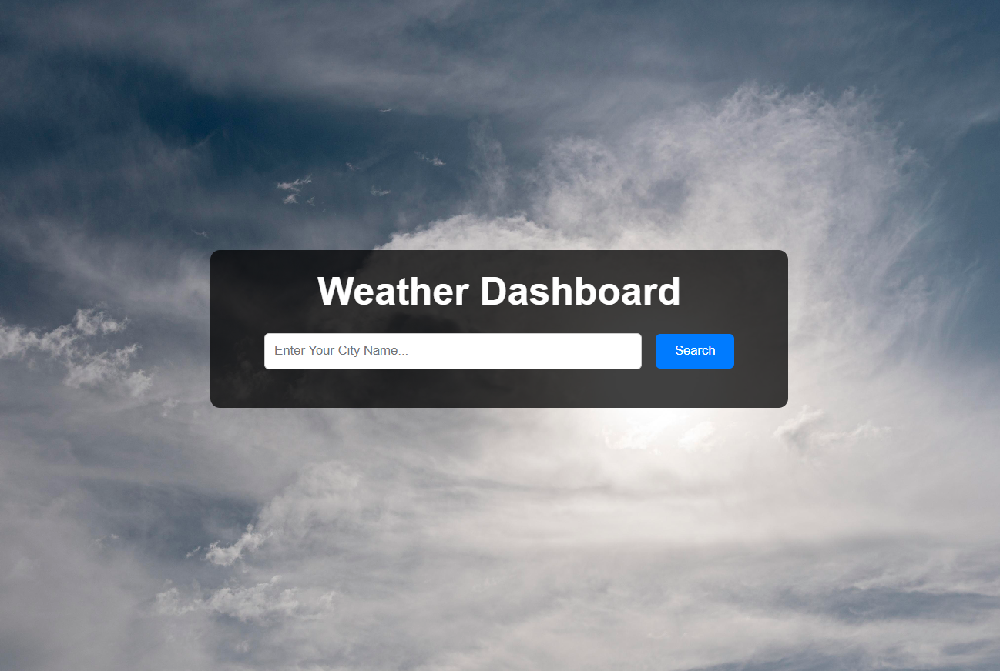

# Weather Dashboard

## Description
This Weather Dashboard project provides current weather conditions and a 5-day weather forecast for any city. It uses data from the OpenWeatherMap API to display weather information and an interactive map to show the location and weather conditions visually.

## Features
- **Current Weather**: Displays the current temperature, weather conditions, humidity, and wind speed for the searched city.
- **5-Day Forecast**: Provides a 5-day weather forecast with temperature and conditions.
- **Interactive Map**: Shows the location of the city on a map with weather overlays.

## APIs Used
- **OpenWeatherMap API**: Provides current weather data and 5-day weather forecasts.
- **Leaflet**: Used to display the interactive map with weather overlays from OpenWeatherMap.

## File Structure
- `index.html`: The main HTML file for the website.
- `style.css`: The custom CSS file for styling the website.
- `script.js`: The JavaScript file containing the functionality to fetch and display weather data.
- `images/`: This folder contains images used in the website.
- `screenshots/`: This folder contains screenshots of website.

## How to Use
1. Change API key in script.js file into your API key. (get it from open weather website)
2. Open `index.html` in your web browser to view the weather dashboard.
3. Enter a city name in the search box and click the "Get Weather" button.
4. View the current weather conditions, 5-day forecast, and the interactive map.

## Live Demo
You can view the live demo of this project here: [Weather Dashboard](https://yassenali.github.io/Weather-Dashboard/)

## Examples
- **London Weather**:
  
- **Rome Weather**:
  

## Acknowledgments
- OpenWeatherMap for providing weather data.
- Leaflet for the interactive map library.
